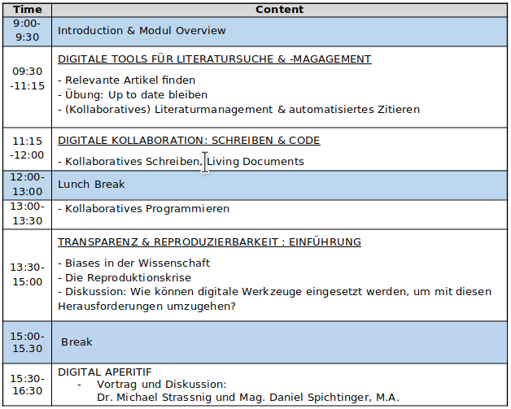

```{r xaringan-themer, include=FALSE, warning=FALSE}
# #This block contains the theme configuration for the CSS lab slides style
library(xaringanthemer) #
library(showtext)
style_mono_accent(
  base_color = "#1f5c99",
  text_font_size = "1.5rem",
  header_font_google = google_font("Raleway"),#("Yanone Kaffeesatz"),
  text_font_google   = google_font("Arial", "300", "300i"),
  code_font_google   = google_font("Fira Mono")
)
```

```{r setup, include=FALSE}
options(htmltools.dir.version = FALSE)
```

layout: true

<!-- --- -->
<!-- class: inverse, center, middle, title-slide -->
<!-- background-image: url(figures/title_slide.svg) -->
<!-- background-size: contain -->


<!-- --- -->
<!-- class: inverse, center, middle, title-slide -->

<!-- # Introduction & Overview -->


<!-- ### Dr. Jana Lasser (*CSH Vienna & Meduni Wien*) <br> Dr. Hannah Metzler  (*TU Graz & CSH Vienna*) -->

<!-- #### Folien: github.com/JanaLasser/digitalisation-in-research-module-2 -->

---
layout: true
<div class="my-footer"><span>
<a href ="https://github.com/JanaLasser/digitalisation-in-research-module-2"> Folien: https://github.com/JanaLasser/digitalisation-in-research-module-2  </a>
</span></div>

---

# Wer sind wir?

**Dr. Jana Lasser** <br> <br>
TU Graz <br>
Physik und Data Science  <br> <br>
www.janalasser.at    |    jana.lasser@tugraz.at    |    Twitter: @janalasser <br>

**Dr. Hannah Metzler**  <br> <br>
Complexity Science Hub Wien und Meduni Wien <br>
Psychologie, Neurowissenschaft und Data Science <br> <br>
www.hannahmetzler.eu    |    metzler@csh.ac.at    |    Twitter: @hannahmetzler1

---

# Was erwartet euch? 

**Digitale Tools für alle Schritte in Forschungsprojekten**

.pull-left[
* Literatursuche & Management

* Kollaboration: Schreiben & Code

* Transparenz & Reproduzierbarkeit: 

    * Biases in der Wissenschaft
    * Research Workflows
    * Data Management
    * Dokumentation
    * Code & Lizenzen
]
    
.pull-right[
* Wissenschaftskommunikation

  * Neue Publikationsformen
  * Social Media: Twitter
]

???
Viel praktisches, hoffentlich gut mit Zoom
Rundumschlag, hoffentlich einzelne Tools dabei

---

# Slides und Kursmaterialien

https://github.com/JanaLasser/digitalisation-in-research-module-2

---

.left-column[
# Zeitplan Tag 1
]

.right-column[.center-right[
```{r, echo=FALSE, out.width=700}

```
]]

???
Immer gerne fragen, unterbrechen
Videos

---

.left-column[
# Zeitplan Tag 2
]

.right-column[.center-right[
```{r, echo=FALSE, out.width=700}
knitr::include_graphics('figures/timeplan_day2.png')
```
]]

???
Immer gerne fragen, unterbrechen
Videos


---

# Wer seid ihr?

* Wissenschaftliche Disziplin

* Mehr qualitative oder mehr quantitative Forschung?

* Interesse an Digitalisierung?

* Erfahrung mit Open Science Practices? 
  * Repositories
  * Präregistrierung
  * Open Data, Code etc?

* Erfahrung mit Code? R, Python etc?


