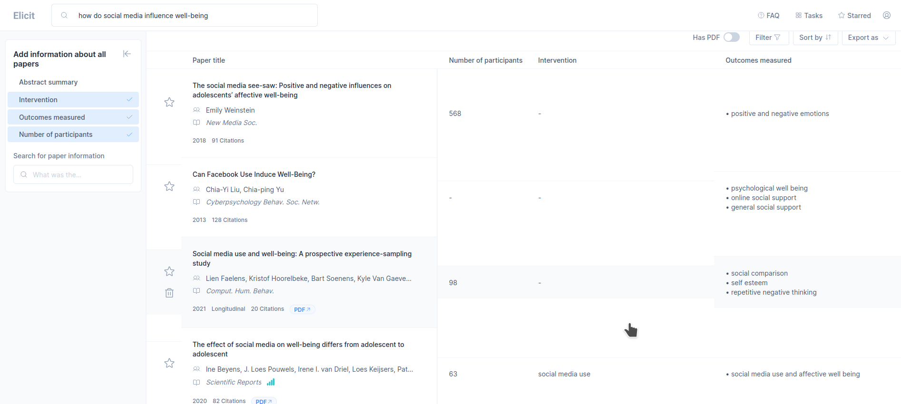
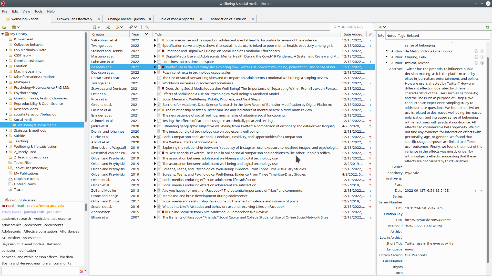
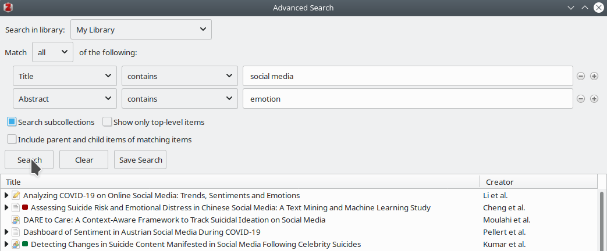

```{r xaringan-themer, include=FALSE, warning=FALSE}
# #This block contains the theme configuration for the CSS lab slides style
library(xaringanthemer) #
library(showtext)
style_mono_accent(
  base_color = "#1f5c99",
  text_font_size = "1.5rem",
  header_font_google = google_font("Raleway"),#("Yanone Kaffeesatz"),
  text_font_google   = google_font("Arial", "300", "300i"),
  code_font_google   = google_font("Fira Mono")
)
```

```{r setup, include=FALSE}
options(htmltools.dir.version = FALSE)
```

layout: true
<div class="my-footer"><span><a href = "www.hannahmetzler.eu"> Hannah Metzler </a> </span></div> 


---
# Overview

1. AI-powered & open source tools for literature search to find relevant articles

  * Workflow: **Google Scholar, Zotero + ResearchRabbit**
  
  * Finding specific articles or get an overview: **Elicit**

2. Staying informed
  * Practical exercises with these tools

3. (Collaborative) Management of literature & citations: **Zotero**

???
<!-- --- -->

<!-- # Open Knowledge Maps -->

<!-- .left-column[ -->
<!-- ```{r, echo=FALSE, out.width=130, fig.align='left'} -->
<!--  -->
<!-- ``` -->
<!-- <br> -->
<!-- ```{r, echo=FALSE, out.width=130, fig.align='right'} -->
<!-- knitr::include_graphics("figures/knowledge_map_irrelevant.png") -->
<!-- ``` -->
<!-- ```{r, echo=FALSE, out.width=150, fig.align='left'} -->
<!--  -->
<!-- ``` -->
<!-- ```{r, echo=FALSE, out.width=85, fig.align='right'} -->
<!--  -->
<!-- ``` -->
<!-- ] -->

<!-- .right-column[.center-right[ -->
<!-- * Visual search engine at [openknowledgemaps.org](https://openknowledgemaps.org) -->

<!--   * Get an overview of a research topic -->

<!--   * Clustering similar papers  -->
<!--       * Based on text similarity algorithm -->

<!--   * Identify relevant concepts -->
<!--   * Highlights open content -->

<!-- ]] -->

<!-- --- -->
<!-- ```{r, echo=FALSE, out.width=950} -->
<!-- knitr::include_graphics("figures/knowledge_map.png") -->
<!-- ``` -->
<!-- --- -->
<!-- ```{r, echo=FALSE, out.width=950} -->
<!-- knitr::include_graphics("figures/knowledge_maps_zoomin.png") -->
<!-- ``` -->
<!-- --- -->

<!-- # Smart literature search: scite_ -->

<!-- * Web Of Science, Scopus, Pubmed, Google Scholar, ... -->

<!-- ```{r, echo=FALSE, out.width=100, fig.align='left'} -->
<!--  -->
<!-- ``` -->

<!-- * [**Scite.ai**](https://scite.ai): Platform for discovering and evaluating scientific articles -->
<!-- <br> -->
<!-- * Search within articles (not just titles/abstracts) -->
<!-- * What research articles say about each other -->
<!-- * Powered by Deep Learning -->
<!-- <br><br> -->
<!-- * Smart Citations:  -->
<!--   * Displays the context of the citation -->
<!--   * Classification: supporting or contrasting evidence for the cited claim -->

<!-- --- -->
<!-- ## Scite_: Smart citations -->

<!-- ```{r, echo=FALSE, out.width=800} -->
<!-- knitr::include_graphics("figures/smart-citations-illo.svg") -->
<!-- ``` -->
<!--  Source: Scite.ai -->

<!-- --- -->

<!-- ## Useful Scite_ features: search & reports -->

<!-- * Literature [search](https://scite.ai/search?q=power%20posing) with smart citations -->

<!-- ```{r, echo=FALSE, out.width=1000} -->
<!--  -->
<!-- ``` -->
<!-- * [Citation reports](https://scite.ai/reports/power-posing-1L19pj) on a publication -->
<!--     * Citation type: Contrasting, supporting, mentioning -->
<!--     * Citation section: Introduction, methods, results, discussion -->
<!--     * Publication type: preprint, article, book -->
<!--     * Self-cite vs. independent -->

<!-- --- -->

<!-- ## Useful Scite_ features: checks & add-on -->

<!-- * Upload documents to [check the reliability of references](https://scite.ai/reference-check/c1c9bbe2-976a-4adb-9d02-fa173329bf3a) -->
<!--     * Stop citing retracted or heavily disputed papers unintentionally -->
<!-- <br><br> -->
<!-- * Alerts for citations, publications or research claims -->
<!-- <br><br> -->
<!-- * [Browser extension](https://scite.ai/extension-install) -->
<!--     * e.g. on Google Scholar: -->

<!-- ```{r, echo=FALSE, out.width=1000} -->
<!--  -->
<!-- ``` -->

<!-- --- -->

<!-- ## Useful Scite_ features: visualize ciations -->

<!-- ```{r, echo=FALSE, out.width=800} -->
<!-- knitr::include_graphics("figures/scite_visualize.png") -->
<!-- ``` -->

---

# Google Scholar

.pull-left[
* Includes all content (pre-prints etc)

* Ranks articles by citation count

* Researcher profiles with all references

* Adds content immediately: good for alerts
  * Use very specific keywords or important authors
]

.pull-right[
```{r, echo=FALSE, out.width=600}

```
]
---

## If Google Scholar does not find the pdf...

* Google Scholar usually finds open access version of articles behind paywalls

  * Repositories
  * Personal website

#### Other ways to access articles: 

* [CORE](https://core.ac.uk) (Plugin + Website): &ensp;
```{r, echo=FALSE, out.width=60}
knitr::include_graphics("figures/core.svg")
```
      * Locate free versions of articles behind paywall
      
* Absolutely never use Sci-Hub!

---
name: researchrabbit

# Smart literature search: ResearchRabbit

<br>
```{r, echo=FALSE, out.width=200, fig.align='center'}

```
<br> 

* ["Spotify" for papers](https://researchrabbitapp.com)

* Discover papers via recommendations based on articles you chose

* Visualize paper networks: topic, citations, references

* Collaboration networks: Discover research teams & their work

* Timelines, earlier & later work

---

```{r, echo=FALSE, out.width=950, fig.align='center'}
knitr::include_graphics("figures/research_rabbit.png")
```

---

```{r, echo=FALSE, out.width=850, fig.align='center'}

```

---

# Other ResearchRabbit features
.pull-left[
Personalized alerts on new content

Comments/annotations

```{r, echo=FALSE, out.width=250}

```
```{r, echo=FALSE, out.width=250}
knitr::include_graphics("figures/research_rabbit_comments.png")
```
]
.pull-right[
Share collections

```{r, echo=FALSE, out.width=320, fig.align='center'}

```
]


???

# ResearchRabbit vs. scite_

* Scite: smart citations
    * evidence for claims + context
    * 7.99$/month
    * Useful for reviews/meta-analyses
    
* ResearchRabbit: smart recommendations
    * citation and author networks
    * free
    
---
name: workflow
layout: true
<div class="my-footer"><span>
<a href = "https://twitter.com/rdpalacio/status/1601640985858957312"> Workflow: Ruben Dario on Twitter </a>
</span></div>

---

## Literature search workflow

* [Zotero](www.zotero.org): powerful open source literature management
  * Organizes articles into collections (per topic or project)

.right-column[.center-right[
1. Find highly cited articles with Google Scholar
2. Open on publisher website & import to Zotero collection
3. Sync the collection with ResearchRabbit
4. Explore recommendations via ResearchRabbit
5. Add papers to Zotero collection via ResearchRabbit

```{r, echo=FALSE, out.width=750}

```
]]

.left-column[
#### Workflow
```{r, echo=FALSE, out.width=200}
knitr::include_graphics("figures/zotero_addtocollection_browser.png")
```
]

---
layout: true
name: elicit
<div class="my-footer"><span><a href = "www.hannahmetzler.eu"> Hannah Metzler </a> </span></div> 

---

# [Elicit: The AI research assistant](www.elicit.org)

```{r, echo=FALSE, out.width=1000}
knitr::include_graphics("figures/elicit_start.png")
```
---

# [Elicit](www.elicit.org): useful features

- Can help you find specific studies with advanced filters
  - Comparison Google Scholar: finds highly cited/central papers
  
- Summarizes abstracts (also across several papers)
.pull-left[.center-left[
- Overview of

  - Interventions
  - Outcome measures
  - Sample size
  ]]
.pull-right[
- Study information

  - Sample description
  - Trustworthiness
  - How is it cited?
  - Find information within paper
]

---

## Paper overview 

```{r, echo=FALSE, out.width=1300}

```
---

## Intervention, outcome measure and sample size

```{r, echo=FALSE, out.width=1300}

```

---

## Study information 

.pull-left[
```{r, echo=FALSE, out.width=570}

```
]
.pull-right[
```{r, echo=FALSE, out.width=550}

```
]
---

## Find information in paper

.pull-left[

Enter a question/keyword

```{r, echo=FALSE, out.width=570}

```
]
.pull-right[

Text is highlighted in the source

```{r, echo=FALSE, out.width=550}

```
]
---

## Find specific types of papers

.pull-left[

With keywords

```{r, echo=FALSE, out.width=570}

```
]
.pull-right[

With filters
```{r, echo=FALSE, out.width=450}

```
]
---

## Summaries across small sets of studies

```{r, echo=FALSE, out.height=500}

```


---

# Staying informed: Exercise (15 min)

* Topic 1:  [ResearchRabbit](https://researchrabbit.ai)
      * Create a collection & explore steps from [overview slide](#researchrabbit)
      * Set an alert
      
* Topic 2: [Elicit](www.elicit.org): Explore all steps from [slides](#elicit) with a question of your interest

* Topic 3: Implement the [workflow](#workflow) 
  * Find a highly cited paper on [Google Scholar](https://scholar.google.com/) or a specific paper on [Elicit](www.elicit.org)
  * Add to a Zotero collection, and sync it with [ResearchRabbit](https://researchrabbit.ai)
  * Expand your collection

* ([Twitter](www.twitter.com): Follow the most important scholars for your research topic)

---

# Break? 

* Literature management with Zotero after the break

* To follow along in Zotero: 

  * Installed Zotero and Connector plugin for browser?
  
  * https://www.zotero.org/download/


---

# (Collaboratively) Managing literature

.pull-left[
* Mendeley, Endnote, F1000, Citavi
* [**Zotero**](https://www.zotero.org/): Open source & flexible

* **Store, organize and cite papers**
* Store PDFs in Zotero or with links to folders

* Online storage for access everywhere
]

.pull-right[
* Organize: Collections & tags

* Citing: 
  * Add-ins for Word, GoogleDocs
  * Automated bibliographies
  
* Group libraries for sharing literature

* Marking PDFs & automatic notes
]

---

```{r, echo=FALSE, out.width=1050}

```

---

## Zotero features on previous slide

* My Library
* Collections
  * Subcollections <br> <br>
* Items (articles)
  * Snapshot of website (available offline)
  * Attached PDFs (automatic option) <br> <br>
* Item features: 
  * Info
    * Item Type: article, book chapter, report, pre-print, conference paper etc
  * Notes
  * Tags
  * Related

---

## Zotero: Getting papers into your library

.pull-left[
* Via the browser extension:  
```{r, echo=FALSE, out.width=400}
knitr::include_graphics("figures/zotero_add_browser.png")
```
<br><br>
* Pull PDFs into Zotero
  * Automatic meta-data & renaming
]

.pull-right[
* With item identifier (ISBN, DOI): 
```{r, echo=FALSE, out.width=500}

```

* Papers get added into currently active collection
]
* Most scientific databases automatically add keywords as tags

---

## Zotero: Collections & tags for organizing papers

* Collections: each item can be in several collections <br>

.left-column[
* Tags
* Draw onto a tag to tag many items at once
<br> <br> <br> <br>
* Colour tags
]
.right-column[.center-right[
```{r, echo=FALSE, out.width=800}
knitr::include_graphics("figures/zotero_tags.png")
```
<br><br>
```{r, echo=FALSE, out.width=250}
knitr::include_graphics("figures/zotero_colour_tags.png")
```
```{r, echo=FALSE, out.width=500}
knitr::include_graphics("figures/zotero_colour_tags_papers.png")
```
]]

---

# Zotero: Features of each item

* Related articles &ensp;
```{r, echo=FALSE, out.width=730}
knitr::include_graphics("figures/zotero_related_entries.png")
```

* Automatic summary notes with annotations from PDF &ensp; <br>
  * Right click on PDF: Add notes from annotations

* Press Alt to find collection of an item &ensp;
```{r, echo=FALSE, out.width=500}

```

* Drag-&-drop PDF or item entry from Zotero to send/move files or reference

---

## Notes & Annotating PDFs

```{r, echo=FALSE, out.width=1000}
knitr::include_graphics("figures/zotero_notes.png")
```

```{r, echo=FALSE, out.width=1000}

```

---

## Zotero: Syncing libarary & PFDs

.left-column[
* 300MB: free

* 2GB: 20 Euro/year

* 6GB: 60 Euro/year
]

.right-column[.center-right[
```{r, echo=FALSE, out.width=450}
knitr::include_graphics("figures/zotero_syncing.png")
```
]]


---

# Search and saved searches

* Quick search: 
  * speed it up by starting with " in large collections

```{r, echo=FALSE, out.width=250, fig.align='center'}
knitr::include_graphics("figures/zotero_search.png")
```

.pull-left[
* Advanced search: 
    * can be saved
    * constantly updating collection
]
.pull-right[
```{r, echo=FALSE, out.width=550, fig.align='right'}

```
]
---

## Group libraries

.pull-left[
* Invite other users to group on [zotero.org](https://www.zotero.org/groups)
  * for collaborative projects <br>
]
.pull-right[
in Zotero:
```{r, echo=FALSE, out.width=300, fig.align='left'}
knitr::include_graphics("figures/zotero_group_libraries.png")
```
]
* Make collections available online
  * private or public
  * read or edit access
  * for sharing literature lists/PDFs or discover sources of others
  
---

## Zotero: Citations

.pull-left[.center-left[
* Add-ins for Word, Libre Office, Google Docs are included
  * Exporting BibTex citations for Overleaf & Latex
<br>

* Automated reference lists
<br> <br>

* Quickly switch between citation styles
]]
.pull-right[.center-right[
GoogleDoc: 
```{r, echo=FALSE, out.width=400}

```
```{r, echo=FALSE, out.width=600}
knitr::include_graphics("figures/zotero_reflist.png")
```
```{r, echo=FALSE, out.width=350}
knitr::include_graphics("figures/zotero_citation_styles.png")
```
]]

---

## Zotero: Citation tips

.pull-left[.center-left[
* Suppress authors, add text before after citation in brackets

* Word/Libre Office quicker than Google Docs <br>
  * Switching is difficult

* Set language to English when choosing citation style

* In Bibliography: check item type in Zotero if formatting not correct (article, book, etc)
]]
.pull-right[.center-right[
```{r, echo=FALSE, out.width=500}
knitr::include_graphics("figures/zotero_suppress_prefix.png")
```
]]

???

## Combine Zotero & Scite

* [Zotero plug-in](https://scite.ai/blog/introducing-the-scite-plug-in-for-zotero-61189d66120c): extra columns for citations of articles in your library
  * Right click to view Scite report

```{r, echo=FALSE, out.width=1100}
knitr::include_graphics("figures/zotero-scite.png")
```

---

## Zotero: More resources 

* [Documentation](https://www.zotero.org/support/start)

* [Quick start guide](https://www.zotero.org/support/quick_start_guide)

* [12 must know Zotero tips and techniques](
http://ideophone.org/12-zotero-tips-and-techniques)

* [Numerous other Add-ons](https://www.zotero.org/support/plugins)

---

## Zotero exercises for day 2

.pull-left[
* Add a paper to a collection: 
  * via plugin on publisher website
  * by pulling in a PDF
  * via DOI
  
* Add keywords in "Tags"
* Create a color tag "to read" in red

* Link it to a second related article

* Make & save an advanced search
]

.pull-right[
* Open a PDF within Zotero, mark important sentences/keywords
  * Add note from annotations
* In a Google or Word doc
  * Add a few citations, with/wo author
  * Create a reference list
  
* For [Obsidian](https://obsidian.md/) users: check out step 10-15 in this [tutorial](https://twitter.com/rdpalacio/status/1601641098535129088)
  
]
