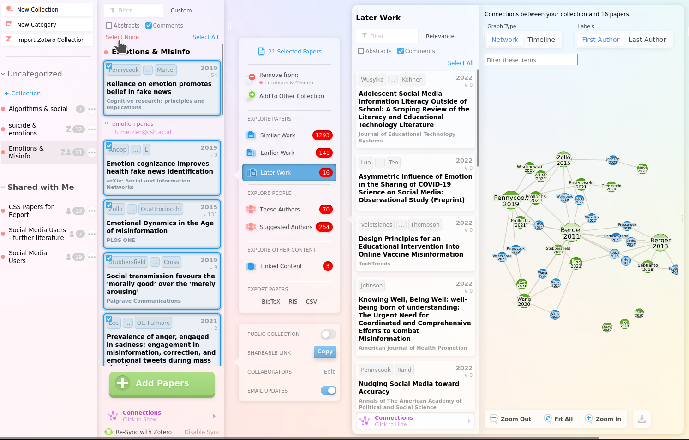

```{r xaringan-themer, include=FALSE, warning=FALSE}
# #This block contains the theme configuration for the CSS lab slides style
library(xaringanthemer) #
library(showtext)
style_mono_accent(
  base_color = "#1f5c99",
  text_font_size = "1.5rem",
  header_font_google = google_font("Raleway"),#("Yanone Kaffeesatz"),
  text_font_google   = google_font("Arial", "300", "300i"),
  code_font_google   = google_font("Fira Mono")
)
```

```{r setup, include=FALSE}
options(htmltools.dir.version = FALSE)
```

layout: true
<div class="my-footer"><span>
<a> Digitalisation in Research: hannahmetzler.eu/literature  </a>
</span></div>

---
# Overview

1. Finding relevant articles
  * Overview: Open Knowledge Maps
  * Smart literature search: Scite & Research rabbit
<br><br>
2. Staying informed
  * Practical session: Setting alerts & Twitter
<br><br>
3. (Collaborative) Management of literature & citations
  * Zotero
  * Integration with text processing software

---

# Open Knowledge Maps


.left-column[
```{r, echo=FALSE, out.width=130, fig.align='left'}
knitr::include_graphics("figures/knowledge_map_overview.png")
```
<br>
```{r, echo=FALSE, out.width=130, fig.align='right'}

```
```{r, echo=FALSE, out.width=150, fig.align='left'}
knitr::include_graphics("figures/knowledge_map_concepts.png")
```
```{r, echo=FALSE, out.width=85, fig.align='right'}
knitr::include_graphics("figures/knowledge_map_open.png")
```


]
.right-column[.center-right[
* Visual search engine at [openknowledgemaps.org](https://openknowledgemaps.org)

  * Get an overview of a research topic
  
  * Clustering similar papers 
      * Based on text similarity algorithm
  
  * Identify relevant concepts
  * Highlights open content
  
]]

---
```{r, echo=FALSE, out.width=950}
knitr::include_graphics("figures/knowledge_map.png")
```
---
```{r, echo=FALSE, out.width=950}

```
---

# Smart literature search: scite_

* Web Of Science, Scopus, Pubmed, Google Scholar, ...

```{r, echo=FALSE, out.width=100, fig.align='left'}
knitr::include_graphics("figures/scite.svg")
```

* [**Scite.ai**](https://scite.ai): Platform for discovering and evaluating scientific articles
<br>
* Search within articles (not just titles/abstracts)
* What research articles say about each other
* Powered by Deep Learning
<br><br>
* Smart Citations: 
  * Displays the context of the citation
  * Classification: supporting or contrasting evidence for the cited claim

---
## Scite_: Smart citations

```{r, echo=FALSE, out.width=800}
knitr::include_graphics("figures/smart-citations-illo.svg")
```
 Source: Scite.ai

---

## Useful Scite_ features: search & reports

* Literature [search](https://scite.ai/search?q=power%20posing) with smart citations

```{r, echo=FALSE, out.width=1000}
knitr::include_graphics("figures/scite_search.png")
```
* [Citation reports](https://scite.ai/reports/power-posing-1L19pj) on a publication
    * Citation type: Contrasting, supporting, mentioning
    * Citation section: Introduction, methods, results, discussion
    * Publication type: preprint, article, book
    * Self-cite vs. independent

---

## Useful Scite_ features: checks & add-on

* Upload documents to [check the reliability of references](https://scite.ai/reference-check/c1c9bbe2-976a-4adb-9d02-fa173329bf3a)
    * Stop citing retracted or heavily disputed papers unintentionally
<br><br>
* Alerts for citations, publications or research claims
<br><br>
* [Browser extension](https://scite.ai/extension-install)
    * e.g. on Google Scholar:

```{r, echo=FALSE, out.width=1000}
knitr::include_graphics("figures/googlescholar_scite.png")
```

---

## Useful Scite_ features: visualize ciations

```{r, echo=FALSE, out.width=800}

```

---
name: researchrabbit

# Smart literature search: ResearchRabbit

* ["Spotify" for papers](https://researchrabbitapp.com): Discover papers via recommendations based on articles you like <br><br>
* Visualize paper networks: topic, citations, references
* Collaboration networks: Discover research teams & their work

* Timelines, earlier & later work

.pull-left[.center-left[
* Personalized alerts on new content

* Comments/annotations
* Share collections
]]
.pull-right[
```{r, echo=FALSE, out.width=200, fig.align='center'}
knitr::include_graphics("figures/researchrabbit_logo.png")
```
]

---

```{r, echo=FALSE, out.width=1500}

```
Source: researchrabbit.ai

---

# ResearchRabbit vs. scite_

* Scite: smart citations
    * evidence for claims + context
    * 7.99$/month
    * Useful for reviews/meta-analyses
    
* ResearchRabbit: smart recommendations
    * citation and author networks
    * free
    
---

# Google Scholar

* Includes all content (preprints etc)
* Adds content immediately: good for alerts
  * Alerts tip: (quite specific) keywords or important author
* Researcher profiles with all references
* Often finds open access version

**Other useful resources for accessing content behind paywalls:**

* [CORE](https://core.ac.uk) (Plugin + Website): &ensp;
```{r, echo=FALSE, out.width=40}

```
      * Locate free versions of articles behind paywall
      
* Absolutely never use Sci-Hub!
.left-column[
]
.right-column[
]

---

# Staying informed: Exercise (15 min)

* [ResearchRabbit](https://researchrabbitapp.com)
      * Create a collection & explore steps from [overview slide](#researchrabbit)
      * Automatically keeps track of new work and sends updates
      
* Alternative 1: [Scite](https://scite.ai): save a search & choose type of alert

* Alternative 2: [Google Scholar](https://scholar.google.com/)
      * Save a search & "Create alert" button

* [Twitter](www.twitter.com): Follow the most important scholars for your research topic

---

# (Collaboratively) Managing literature

* Many: Mendely, Endnote, F1000. Citavi...
* [**Zotero**](https://www.zotero.org/): Open source & very flexible

* **Store, organize and cite papers**
* Store PDFs in Zotero or with links to folders
* Online storage for access everywhere
* Organize: Collections & tags
* Citing: 
  * Add-ins for Word, Google docs etc
  * Automated bibliographies
* Group libraries for sharing literature

---

.left-column[
**Overview**
* Library
* Collections
* Subcollections
* Items
  * Info
  * Notes
  * Snapshot
  * Attached PDFs
* Item types
  * article
  * chapter
  * ...
* Tags
]
.right-column[
```{r, echo=FALSE, out.width=1200}
knitr::include_graphics("figures/zotero_overview.png")
```
]

---

## Zotero: Getting papers into your library

.pull-left[
* Via the browser extension:  
```{r, echo=FALSE, out.width=400}
knitr::include_graphics("figures/zotero_add_browser.png")
```
<br><br>
* Pull PDFs into Zotero
  * Automatic meta-data & renaming
]

.pull-right[
* With item identifier (ISBN, DOI): 
```{r, echo=FALSE, out.width=500}
knitr::include_graphics("figures/zotero_add_doi.png")
```

* Papers get added into currently active collection
]
* Most scientific databases automatically add keywords as tags

---

## Zotero: Collections & tags for organizing papers

* Collections: each item can be in several <br>

.left-column[
* Tags
* Draw onto a tag to tag many items at once
<br> <br> <br> <br>
* Colour tags
]
.right-column[.center-right[
```{r, echo=FALSE, out.width=800}

```
<br><br>
```{r, echo=FALSE, out.width=250}
knitr::include_graphics("figures/zotero_colour_tags.png")
```
```{r, echo=FALSE, out.width=500}
knitr::include_graphics("figures/zotero_colour_tags_papers.png")
```
]]

---

# Zotero: Features of each item

* Related articles &ensp;
```{r, echo=FALSE, out.width=700}

```

* Annotations: 
  * Marked parts of PDF as a summary
  * Zotfile extension: Manage Attachments => Extract Annotations

* Press Alt to find collection of an item &ensp;
```{r, echo=FALSE, out.width=500}
knitr::include_graphics("figures/zotero_findcollection.png")
```

* Drag-&-drop PDF or item entry from Zotero to send/move files or reference


---

## Zotero: Syncing libarary & PFDs

.left-column[
* 300MB: free

* 2GB: 20 Euro/year

* 6GB: 60 Euro/year
]

.right-column[.center-right[
```{r, echo=FALSE, out.width=450}
knitr::include_graphics("figures/zotero_syncing.png")
```
]]


---

# Search and saved searches

* Quick search: 
  * speed it up by starting with " in large collections

```{r, echo=FALSE, out.width=250, fig.align='center'}

```
  
* Advanced search: 
    * can be saved
    * constantly updating collection
    
```{r, echo=FALSE, out.width=400, fig.align='center'}
knitr::include_graphics("figures/zotero_advanced_search_window.png")
```

---

## Group libraries

.pull-left[
* Invite other users to group on [zotero.org](https://www.zotero.org/groups)
  * for collaborative projects <br>
]
.pull-right[
in Zotero:
```{r, echo=FALSE, out.width=300, fig.align='left'}

```
]

* Make collections available online
  * private or public
  * read or edit access
  * for sharing literature lists/PDFs or discover sources of others
  
---

## Zotero: Citations

.pull-left[.center-left[
* Add-ins for Word, Libre Office, Google Docs are included
  * Exporting BibTex citations for Overleaf & Latex
<br>

* Automated reference lists
<br> <br>

* Quickly switch between citation styles
]]
.pull-right[.center-right[
GoogleDoc: 
```{r, echo=FALSE, out.width=400}
knitr::include_graphics("figures/zotero_googledoc.png")
```
```{r, echo=FALSE, out.width=600}
knitr::include_graphics("figures/zotero_reflist.png")
```
```{r, echo=FALSE, out.width=350}

```
]]

---

## Zotero: Citation tips

.pull-left[.center-left[
* Suppress authors, add text before after citation in brackets

* Word/Libre Office quicker than Google Docs <br>
  * Switching is difficult

* Set language to English when choosing citation style

* In Bibliography: check item type in Zotero if formatting not correct (article, book, etc)
]]
.pull-right[.center-right[
```{r, echo=FALSE, out.width=350}
knitr::include_graphics("figures/zotero_suppress_prefix.png")
```
]]
---

## Combine Zotero & Scite

* [Zotero plug-in](https://scite.ai/blog/introducing-the-scite-plug-in-for-zotero-61189d66120c): extra columns for citations of articles in your library
  * Right click to view Scite report

```{r, echo=FALSE, out.width=1100}
knitr::include_graphics("figures/zotero-scite.png")
```

---

## Zotero: More resources 

* [Documentation](https://www.zotero.org/support/start)

* [Quick start guide](https://www.zotero.org/support/quick_start_guide)

* [12 must know Zotero tips and techniques](
http://ideophone.org/12-zotero-tips-and-techniques)

* [Numerous other Add-ons](https://www.zotero.org/support/plugins)

