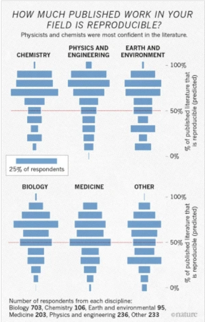

```{r xaringan-themer, include=FALSE, warning=FALSE}
# #This block contains the theme configuration for the CSS lab slides style
library(xaringanthemer) #
library(showtext)
style_mono_accent(
  base_color = "#1f5c99",
  text_font_size = "1.5rem",
  header_font_google = google_font("Raleway"),#("Yanone Kaffeesatz"),
  text_font_google   = google_font("Arial", "300", "300i"),
  code_font_google   = google_font("Fira Mono")
)
```

```{r setup, include=FALSE}
options(htmltools.dir.version = FALSE)
```

layout: true

---

# Can humans predict the future? 
## History of the reproducibility crisis in psychology

* Bem 2011: Humans can predict in which location erotic images will appear

* False positive psychology: Analytic flexilibity 
  * Outlier exclusion
  * 
  * 
  
* False positive rate 6x%

---
layout: true
<div class="my-footer"><span>
<a> Open Science Collaboration 2015; Klein et al. 2014; Camerer et al. 2018; Camerer et al. 2016; Hensel 2021; Gordon et al. 2020
</a></span></div>

---

# Reproducibility in the social sciences

.pull-left[.center-left[
* [Psychology 2015](http://science.sciencemag.org/content/349/6251/aac4716): 100 random studies: 38% replicated

* 13 famous findings in [social psychology 2014](https://econtent.hogrefe.com/doi/10.1027/1864-9335/a000178): 38% replicated

* [Behavioural economics 2016](http://science.sciencemag.org/content/351/6280/1433): 61%

* [Social sciences 2018](https://www.nature.com/articles/s41562-018-0399-z): published in Nature & Science 2010-2015: 50%-67%

* [SCORE project](https://royalsocietypublishing.org/doi/10.1098/rsos.200566): Expert pedictions
]]
.pull-right[.center-right[
Expected replication rates: 
```{r, echo=FALSE, out.width=500}
knitr::include_graphics("figures/Golden_scoreproject.svg")
```
]]
    
    
???
[Management](https://www.sciencedirect.com/science/article/pii/S0263237321000025?dgcid=rss_sd_all)

---
layout: true
<div class="my-footer"><span>
<a> Begley & Ioannidis 2015; Errington et al. 2014; Prinz et al. 2011; Begley & Ellis 2012;  Francis, 2014; Ioannidis et al. 2009;   Lancee et al. 2017;<br> Amara & Neves 2021
</a></span></div>

---

# Problems & projects in biology & medicine

* [Review for basic and preclinical biomedical research](http://circres.ahajournals.org/content/116/1/116)
* A few examples: 

  * [Cancer Biology](https://elifesciences.org/articles/04333), oncology, women's health, cardiovascular diseases: so far [5 of 17](https://www.nature.com/articles/d41586-021-02486-7?proof=t%C2%A0) highly cited articles, [25%](https://www.nature.com/articles/nrd3439-c1?linkId=33568131), [11%](https://www.nature.com/articles/483531a#Tab1)
  
  * [Micro-array based gene expression studies](https://pubmed.ncbi.nlm.nih.gov/19174838/): 10-40% replicate, <br> issues in [epigenetics](http://www.genetics.org/content/198/2/449), [DNA methylation methods](https://www.sciencedirect.com/science/article/pii/S2666389920300143)
  
  * Pharmacology of [antipsychotic drugs](https://www.nature.com/articles/tp2017203): 81% deviate from registered plan
  
  * [Brazilian Reproducibility Initiative](https://www.nature.com/articles/d41586-021-02486-7?proof=t%C2%A0) for biomedical research

---
layout: true
<div class="my-footer"><span>
<a> Kapoor & Narazanan 2021; Baker 2016
</a></span></div>

---

.pull-left[
## 'Hard' sciences

* Computational reproducibility in [Machine Learning](https://reproducible.cs.princeton.edu/): 
  * 4 out of 12 papers 
  * [Checklist](https://www.cs.mcgill.ca/~jpineau/ReproducibilityChecklist.pdf) for reproducible ML

* [Survey](https://www.nature.com/articles/533452a) in natural sciences =>
]

.pull-right[

```{r, echo=FALSE, out.width=380}

```
]

---
layout:true

---

# Cognitive biases all humans have

* Selection bias: Seeking out information

* Confirmation bias: Evaluating information

* Bandwagon effect: agree to easily for group harmony

* Cluster illusion: Recognizing patterns where there are none

* Reporting bias: positive results

???
https://www.nature.com/articles/d42473-019-00004-y#ref-CR17 mentions bandwgon and cluster illustion, not sure if good sources cited for this

---

# Biases in Research

* HARKing: Hypothesizing after results are known


---

# Biases throughout the research process

```{r, echo=FALSE, out.width=380}
knitr::include_graphics("figures/cruwell_biases_cycle.png")
```

* Design: specific task/stimuli/method… 
* Data collection: experimenter biases
  * Bright vs. dull rats (Rosenthal & Lawson 1964)
  * Power priming
* Confirmation bias
* Data analysis: experimenter degrees of freedom 
  * Inclusion of data points, conditions, participants, analysis methods, …
  * Looking at results before stopping data collection
* Write up and publication bias: 
  * Selective submission and acceptance
  * Avoiding null-results & non-replications

---

# Discussion

### How could digital tools be used to address such problems in your discipline?