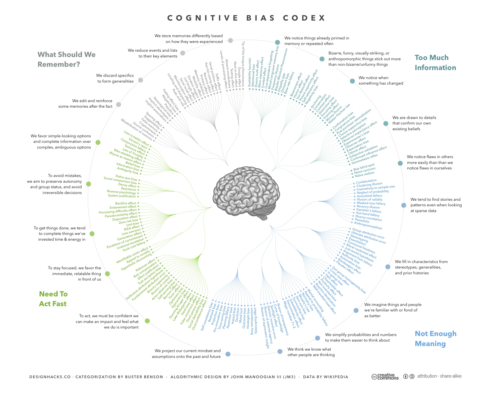

```{r xaringan-themer, include=FALSE, warning=FALSE}
# #This block contains the theme configuration for the CSS lab slides style
library(xaringanthemer) #
library(showtext)
style_mono_accent(
  base_color = "#1f5c99",
  text_font_size = "1.5rem",
  header_font_google = google_font("Raleway"),#("Yanone Kaffeesatz"),
  text_font_google   = google_font("Arial", "300", "300i"),
  code_font_google   = google_font("Fira Mono")
)
```

```{r setup, include=FALSE}
options(htmltools.dir.version = FALSE)
```

layout: true
<div class="my-footer"><span><a href = "www.hannahmetzler.eu"> Hannah Metzler </a> </span></div> 
---

## Can humans predict the future? 
### History of the reproducibility crisis in psychology

* [Feeling the future](https://d1wqtxts1xzle7.cloudfront.net/54466465/FeelingFuture-with-cover-page-v2.pdf?Expires=1637600022&Signature=eObuIJc0SRn9JWu0Ww0FhumpxPWmIKDDHNBJ~S-XE0q4lzlYOEfQPl3gS4H~0ENTGRtZbLFGOA2jNr0BSgaLFcMFWnd~PVLN0kAgGbZKlP8-xwD5jTqiOKwqdlmZBKc3KYlDhL8gTNMfQblRsLxGXy71-hAI5G1a~pvkjAQ9rRapLGDPz23idpNP~Eh2oubGad7TJtSvYsXaBNZy~B1PmwX7gD7MtEJoX6hboc-eKUAwN7iG22U-eCFjt29I2AKE5ezvVgEGU0~keW7euzwyIkfHoPf841bmqEb3HNnMPMePbXWGXwaVuLRepIOprH0-B5NcqxXJVNvdYvvQUTuL~w__&Key-Pair-Id=APKAJLOHF5GGSLRBV4ZA): Paper by prominent psychologist in top psychology journal <br>  <br> 
<center>
```{r, echo=FALSE, out.width=160}

```
```{r, echo=FALSE, out.width=160}

```
</center> <br> 
* Exp 1: 53% accuracy in predicting location of *erotic* images (not others) <br>
* Exp 2: Better at remembering words that are repeated later in time <br> <br> 
* 9 experiments, reviewed by 4 reviewers &nbsp;&nbsp; **???**

???
Exp 1:   * Physiolocial sexual arousal 2-3 seconds before the picture <br><br>
Exp 2: Visualize words, surprise recall test, then type 24 random words (memory) - students had better recall for the words they were later asked to type in

---
layout: true
<div class="my-footer"><span>
<a href="https://journals.sagepub.com/doi/full/10.1177/0956797611417632"> Simmons et al. 2011
</a></span></div>

---

# False positive psychology

* Significant finding in psychology: p <.05

* False positive: statistically **significant result** if the **effect is not real**

* Simulations of analytic flexilibity or __researcher degrees of freedom__

    1. 2 outcome variables
    2. Add 10 more observations
    3. Control for gender or interaction gender x treatment
    4. Dropping one of 3 conditions
  
* False positive probability increases **from 5% to 60.7%** if all 4 combined

* Try it yourself: [P-hacking app](http://shinyapps.org/apps/p-hacker/)

---
layout: true
<div class="my-footer"><span>
<a href = "http://amstat.tandfonline.com/doi/abs/10.1080/09332480.2005.10722754"> Ioannidis 2005 </a>
</a></span></div>

---

# Only one negative example? <br> Only psychology?

.left-column[
```{r, echo=FALSE, out.width=200}

```
]

.right-column[.center-right[
* The more flexibility in design…

* The more financial or other interests and prejudices…

* The hotter scientific fields…

… the less likely the research findings are to be true.
]]

---
layout: true
<div class="my-footer"><span>
<a> Open Science Collaboration 2015; Klein et al. 2014; Camerer et al. 2018; Camerer et al. 2016; Hensel 2021; Gordon et al. 2020
</a></span></div>

---

# Reproducibility in the social sciences

.pull-left[.center-left[
* [Psychology 2015](http://science.sciencemag.org/content/349/6251/aac4716): 100 random studies: 38% replicated

* 13 famous findings in [social psychology 2014](https://econtent.hogrefe.com/doi/10.1027/1864-9335/a000178): 38% replicated

* [Behavioural economics 2016](http://science.sciencemag.org/content/351/6280/1433): 61%

* [Social sciences 2018](https://www.nature.com/articles/s41562-018-0399-z): published in Nature & Science 2010-2015: 50%-67%

* [SCORE](https://royalsocietypublishing.org/doi/10.1098/rsos.200566): Expert predictions   ==>
]]
.pull-right[.center-right[
Expected replication rates: 
```{r, echo=FALSE, out.width=500}

```
]]
    
    
???
[Management](https://www.sciencedirect.com/science/article/pii/S0263237321000025?dgcid=rss_sd_all)

---
layout: true
<div class="my-footer"><span>
<a> Begley & Ioannidis 2015; Errington et al. 2014; Prinz et al. 2011; Begley & Ellis 2012; Francis, 2014; Ioannidis et al. 2009; Lancee et al. 2017; <br> Amara & Neves 2021
</a></span></div>

---

# Reproduciblity in biology & medicine

* [Review for basic and preclinical biomedical research](http://circres.ahajournals.org/content/116/1/116) <br> <br> 
* A few examples:  <br> 
  * [Cancer Biology/Oncology](https://elifesciences.org/articles/04333): so far [5 of 17](https://www.nature.com/articles/d41586-021-02486-7?proof=t%C2%A0) highly cited articles replicated <br> 
      * 53 famous findings: [25%](https://www.nature.com/articles/nrd3439-c1?linkId=33568131) replicated by 1 firm,  [11%](https://www.nature.com/articles/483531a#Tab1) by another  <br>  <br> 
  * [Micro-array based gene expression studies](https://pubmed.ncbi.nlm.nih.gov/19174838/) in *Nature genetics*: 10-40%, <br>
      * Issues in [Epigenetics](http://www.genetics.org/content/198/2/449), [DNA methylation methods](https://www.sciencedirect.com/science/article/pii/S2666389920300143) <br> <br> 
  * Pharmacology of [antipsychotic drugs](https://www.nature.com/articles/tp2017203): 81% deviate from registered plan <br> <br> 
  * [Brazilian Reproducibility Initiative](https://www.nature.com/articles/d41586-021-02486-7?proof=t%C2%A0) for biomedical research

---
layout: true
<div class="my-footer"><span>
<a> Kapoor & Narazanan 2021; Cova et al., 2018; Baker 2016
</a></span></div>

---

.pull-left[
# Other disciplines

* Computational reproducibility in [Machine Learning](https://reproducible.cs.princeton.edu/): 
  * 4 out of 12 papers 
  * [Checklist](https://www.cs.mcgill.ca/~jpineau/ReproducibilityChecklist.pdf) for reproducible ML
  
* [Experimental philosophy](https://psyarxiv.com/sxdah)
  * 70% of 40 experiments replicated

* [Survey](https://www.nature.com/articles/533452a) in natural sciences &nbsp;&nbsp;===>

<!-- * Proportion of p-values .045-0.05 Head et al. Plos biology 2015 -->
]

.pull-right[.center[
<br> <br>

]]


---
layout: true
<div class="my-footer"><span>
<a href="https://courses.lumenlearning.com/suny-natural-resources-biometrics/chapter/chapter-3-hypothesis-testing/"> Source Image 1 </a>
<!-- <a href="https://libertytoday.uk/2013/03/07/the-nhs-can-only-guess/searching-blindfolded-man/"> Source Image 2</a> -->
</span></div>

---

# What are the reasons?

.left-column[
<br>
```{r, echo=FALSE, out.width=200}

```

<!-- ```{r, echo=FALSE, out.width=150,fig.align='center'} -->
<!-- knitr::include_graphics("figures/searching-blindfolded-man.jpg") -->
<!-- ``` -->
<br><br><br>
```{r, echo=FALSE, out.width=100,fig.align='center'}

```
]

.right-column[.center-right[
* Basic problems with common methods
<font size="4"> <a href="https://statmodeling.stat.columbia.edu/2016/09/21/what-has-happened-down-here-is-the-winds-have-changed/"> Gelman 2016
</a></font>
    * Researcher degrees of freedom
    * Misunderstanding of statistical null-hypotheses testing
    * Multiple comparisons problems + weak theories

* Humans: Complex systems with many variables

* Problems in the publication system: Incentives
    * Peer review
    * Publication bias for positive findings
    * Pressure to publish <font size="4"> <a href="https://journals.plos.org/plosone/article?id=10.1371/journal.pone.0010271"> Fanelli 2010; 
<a href="https://journals.sagepub.com/doi/10.1177/1556264614552421">Tijdink et al. 2014 </a> </font>
]]
    
---
layout: true
<div class="my-footer"><span>
<a href = "https://revistas.udc.es/index.php/ejge/article/view/ejge.2017.6.1.4322"> Peon et al. 2017 </a>
</a></span></div>

---

# Cognitive biases all humans have

.middle[.left-column[
<br> <br> 
```{r, echo=FALSE, out.width=200}

```
]]

.right-column[.center-right[
* Selection bias: Seeking out information that confirms our view

* Confirmation bias in evaluating information

* Aversion to ambiguity

* Groupthink: agreeing to easily

* Cluster illusion: Recognizing patterns in randomness

* Appeal to novelty
]]

???
https://www.nature.com/articles/d42473-019-00004-y#ref-CR17 mentions bandwgon and cluster illustion, not sure if good sources cited for this

---
layout: true
<div class="my-footer"><span>
<a href = "https://commons.wikimedia.org/wiki/File:Cognitive_Bias_Codex_-_180%2B_biases,_designed_by_John_Manoogian_III_(jm3).jpg"> Benson Manoogian 2016 </a>
</a></span></div>
---
```{r, echo=FALSE, out.width=850, fig.align='center'}

```
---
layout: true
<div class="my-footer"><span>
<a href = "https://www.nature.com/articles/526182a"> Nuzzo 2015; </a>
<a href = "https://sites.google.com/site/cogmasterbonnespratiques/train-yourself"> Good practices material by Alex Christia; </a>
<a href = "https://www.nature.com/articles/s41562-016-0021.pdf"> Munafo et al. 2017 </a>
</a></span></div>

---

# Biases in Research (non-exhaustive list)

* Selection & confirmation bias in literature search & interpretation

* Experimenter bias (e.g. [bright vs. dull rats](https://psycnet.apa.org/record/1965-01547-001), [power priming](http://journals.sagepub.com/eprint/zEiAqVspym6Y3XBmkhMJ/full))

* Poor quality control & documentation

* Results analysis & interpretation: p-hacking, ignoring alternative explanations

* Story telling: Hypothesizing/justifying after results are known <br> ([HARKing, JARKing](https://www.nature.com/articles/526182a))

* Write-up & publication bias towards positive results

* Avoiding null-results & non-replications

---

<!-- # Biases throughout the research process -->

<!-- ```{r, echo=FALSE, out.width=800} -->
<!--  -->
<!-- ``` -->
<!-- [Crüwell et al. 2018](https://osf.io/cfzyx) -->
<!-- --- -->

# What do we do about all of this?

<div style="text-align:center"> <span style="font-weight: bold; color:#1f5c99"> Acknowledge that we are all human:  protect against biases, correct mistakes and change incentives </font> </span> </div>

* Slower and more careful science <font size = "4"> <a href="http://www.sciencedirect.com/science/article/pii/S1364661319302426"> Frith 2020 </a> </font> 
    * Better documentation & transparency (Open Science)
    * Cumulative Science <br> <br>
* Encourage collaboration & team science
    * Large datasets, replication projects
    * Methodological experts<br><br>
* Change incentive structures for publication & hiring <font size = "4"> <a href="https://journals.plos.org/plosbiology/article?id=10.1371/journal.pbio.2000995"> Higginson & Munafo, 2016 </a> </font>
    * Evaluation based on rigour not novelty <br><br>
     
---
layout: true
<div class="my-footer"><span><a href = "www.hannahmetzler.eu"> Hannah Metzler </a> </span></div> 

---

# Concrete Solutions tomorrow!

### Acknowledgements

* Some slides based on presentations by Alex Cristia <br> (Ecole Normale Supérieure, Paris)

    * [Good practices materials](https://sites.google.com/site/cogmasterbonnespratiques/train-yourself)

* Images on slide 2,8 & 9 CC0 from [pixabay.com](www.pixabay.com)

---

# Discussion

* Break-out rooms with 3 people
    * Come back in 30 minutes
    * Summary round (until 15h)

* Which of these biases and problems are issues in your discipline?

* Which solutions can you imagine?

* How could digital tools be used to adress challenges and implement solutions in your discipline?
    * Which tool for which problem/bias?