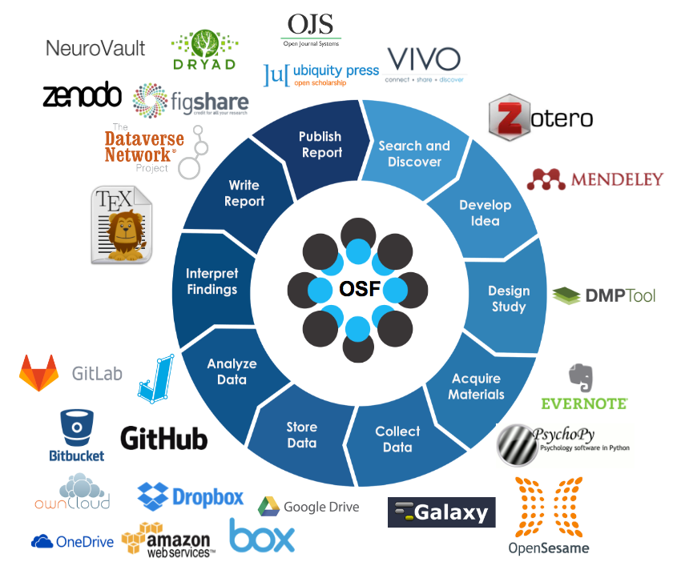

```{r xaringan-themer, include=FALSE, warning=FALSE}
# #This block contains the theme configuration for the CSS lab slides style
library(xaringanthemer) #
library(showtext)
style_mono_accent(
  base_color = "#1f5c99",
  text_font_size = "1.5rem",
  header_font_google = google_font("Raleway"),#("Yanone Kaffeesatz"),
  text_font_google   = google_font("Arial", "300", "300i"),
  code_font_google   = google_font("Fira Mono")
)
```

```{r setup, include=FALSE}
options(htmltools.dir.version = FALSE)
```

layout: true

---

# Open Science Framework

```{r, echo=FALSE, out.width=500}

```


---
layout: true

Source: https://osf.io/yd487/ Schönbrodt, Scheel, Stachl, 2017

---

# Pre-registration

https://osf.io/w82ms/wiki/home/
* A plan, not a prison

* OSF infos: 
https://www.cos.io/initiatives/prereg

Why? 
- prevents p-hacking
- clearly distinguishes exploratory from confirmatory research
- works against publication bias


---

# Pre-registration in pratice

Where? 

* [As predicted](www.aspredicted.org): Short template
* OSF: Detailed template
* Any public, open-access repository with time-stamped version control
  * Github, figshare...

---

```{r, echo=FALSE, out.width=700}
knitr::include_graphics("figures/AsPredicted1.png")
```
---
```{r, echo=FALSE, out.width=700}
knitr::include_graphics("figures/AsPredicted2.png")
```


