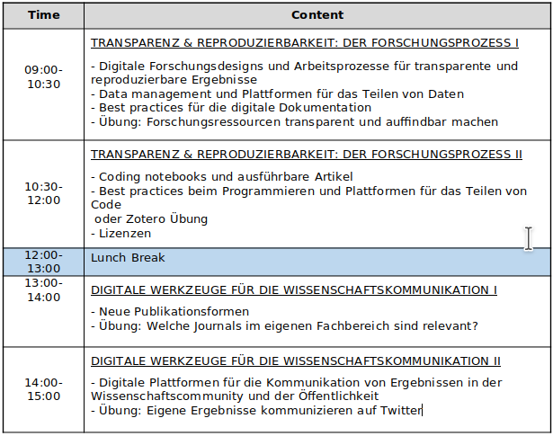
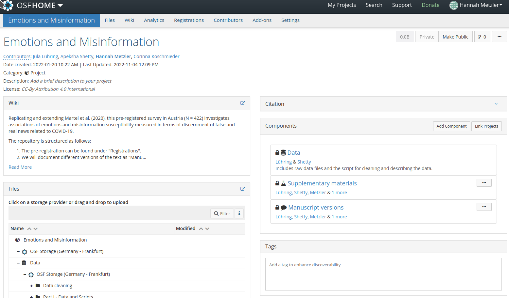
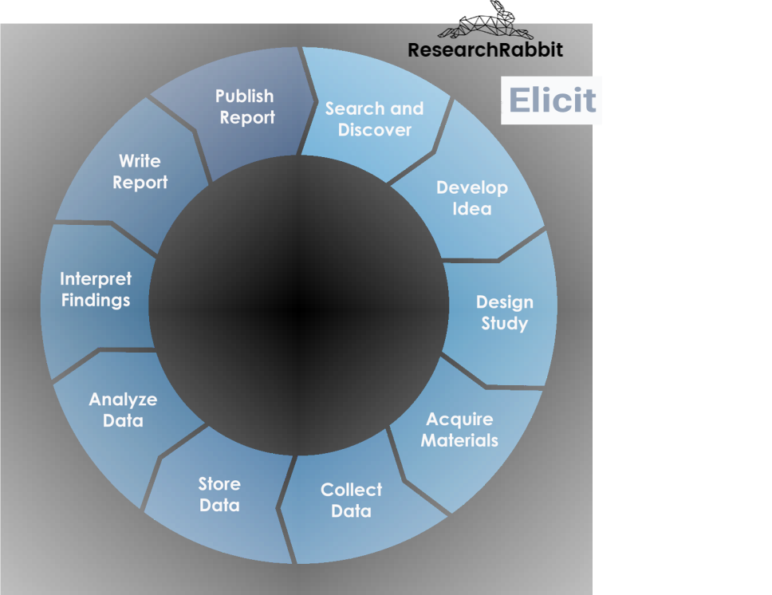
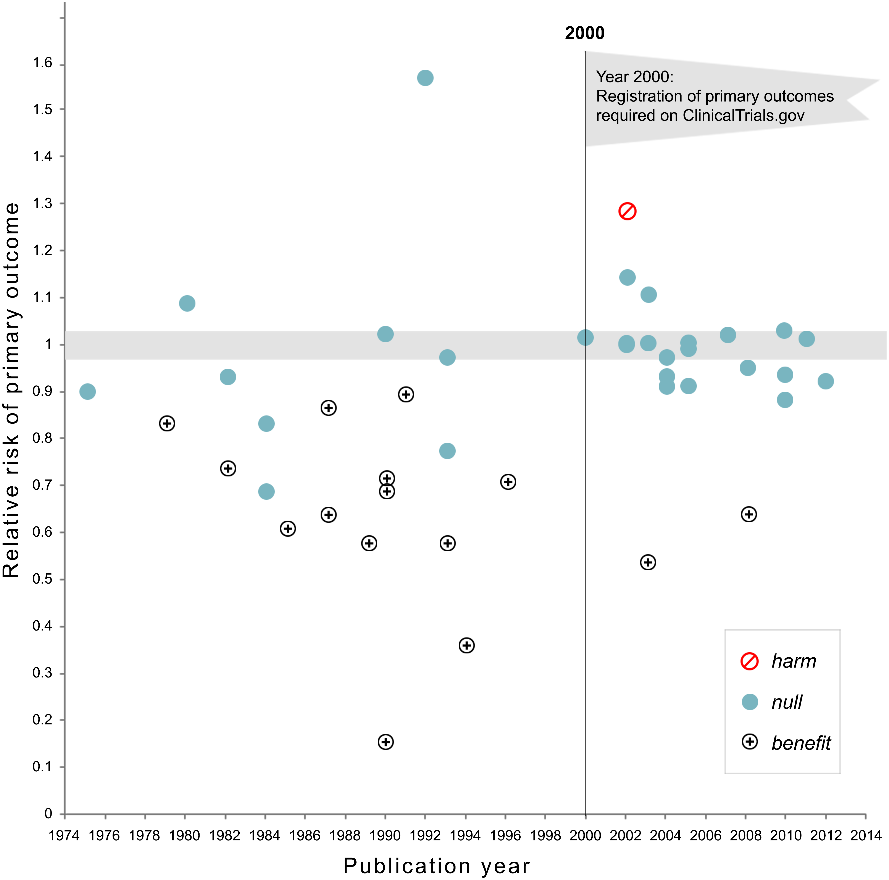
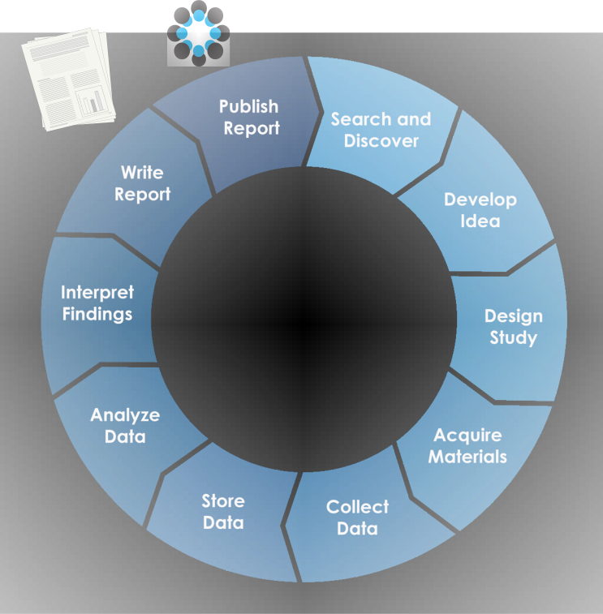

```{r xaringan-themer, include=FALSE, warning=FALSE}

# This is about 15 min too long, around 45 min instead of 30

# #This block contains the theme configuration for the CSS lab slides style
library(xaringanthemer) #
library(showtext)
style_mono_accent(
  base_color = "#1f5c99",
  text_font_size = "1.5rem",
  header_font_google = google_font("Raleway"),#("Yanone Kaffeesatz"),
  text_font_google   = google_font("Arial", "300", "300i"),
  code_font_google   = google_font("Fira Mono")
)
```

```{r setup, include=FALSE}
options(htmltools.dir.version = FALSE)
```

layout: true
<div class="my-footer"><span><a href = "www.hannahmetzler.eu"> Hannah Metzler </a> </span></div> 

---

.left-column[
## Timeplan <br> Day 2
]
.right-column[
```{r, echo=FALSE, out.width=700}

```
]
---
layout: true
<div class="my-footer"><span>
<a href = "https://www.nature.com/articles/526182a"> Nuzzo 2015; </a>
<a href = "https://sites.google.com/site/cogmasterbonnespratiques/train-yourself"> Good practices material by Alex Christia;
<a href = "https://www.nature.com/articles/s41562-016-0021.pdf"> Munafo et al. 2017 </a>
</a></span></div>

---

# Summary Research Biases (Recap)

* Selection & confirmation bias in literature search & interpretation

* Experimenter bias (e.g. [bright vs. dull rats](https://psycnet.apa.org/record/1965-01547-001), [power priming](http://journals.sagepub.com/eprint/zEiAqVspym6Y3XBmkhMJ/full))

* Poor quality control & documentation

* Results analysis & interpretation: p-hacking, ignoring alternative explanations

* Story telling: Hypothesizing/justifying after results are known <br> ([HARKing, JARKing](https://www.nature.com/articles/526182a))

* Write-up & publication bias towards positive results

* Avoiding null-results & non-replications

---

# Solutions

* Slower and more careful science
    * Transparency: Open Science
    * Replications
    * Documentation
    * **Good research practices**

* Encourage collaboration & team science

* Change incentive structures for publication (& hiring)

---
layout: true
<div class="my-footer"><span>
<a href = "www.osf.io"> Open Science Framework; </a>
<a href = "https://osf.io/6zcw6/download"> David Mellor OSF slides</a>
</span></div>
---

.left-column[
## Open Science Framework

* Free & open source

* Entire research workflow

* Tool integration


]
.right-column[.center-right[
.center[Technology to enable change]

```{r, echo=FALSE, out.width=600, fig.align='center'}

```
]]

---

.left-column[
<br>

### Collaboration

###  Documentation

###  Archiving
]
.right-column[

```{r, echo=FALSE, out.width=1000, fig.align='center'}

```
]
---

### Merges public & private workflows

```{r, echo=FALSE, out.width=600}

```

---

### Version Control
```{r, echo=FALSE, out.width=1000, fig.align='center'}

```

---

.left-column[
# Research workflow
]
.right-column[
```{r, echo=FALSE, out.width=550, fig.align='left'}

```
]
---
layout: true
<div class="my-footer"><span><a href = "www.hannahmetzler.eu"> Hannah Metzler </a> </span></div> 

---

# Literature search

.pull-left[.center-left[
```{r, echo=FALSE, out.width=500, fig.align='left'}

```
]]

.pull-right[.center-right[
* Research Rabbit:
  * expand collection with personalized recommendations
  * independent research teams <br><br>
* Elicit: 
  * trustworthiness & sample size
  * critical citations
  * find contrasting evidence <br><br>
* Be aware of your biases
]]
.center[
**Look for alternative findings & explanations**
]

---

# Study design

.pull-left[
```{r, echo=FALSE, out.width=450, fig.align='left'}

```
]

.pull-right[
<br>
* Blinding: e.g. double-blind studies

* Larger studies (statistical power)

* Replications

* Standardized methodologies
]
---

# Research process: Transparency

.pull-left[
**How?**

* Preregistration

* Open data

* Open code

* Open materials

* Transparent reporting
]
.pull-right[
**Why?** 
* Prevents (some) biases

* Enables replication

* Enables meta-analyses

* Enables identification of errors
]

---
layout: true
<div class="my-footer"><span>
<a href = "https://osf.io/yd487/"> Schönbrodt, Scheel & Stachl 2017 </a>
</a></span></div>

---

# Pre-registration
.pull-left[.center-left[
 = Time-stamped pre-study plan

**Why?**
* Protects against HARKing & <br> P-hacking

* Distinguish more confirmatory vs. exploratory research

* Works against publication bias (searching registries)
]]
.pull-right[.center-right[
**What?**
* Hypotheses
  * Relationship between variables <br> <br> 
* Methods
  * Variables, outcomes, conditions
  * Measurement
  * Data collection, sample size, exclusion criteria
* Analysis plan: (control) variables, tests, missing data, ...
]]


---
layout: true
<div class="my-footer"><span>
<a href="https://journals.plos.org/plosone/article?id=10.1371/journal.pone.0132382"> Kaplan & Irvin 2005 Plos One </a>
</span></div>

---

## Effect of pre-registration in clinical trials

.pull-left[
* Clinical trials on cardiovascular risk, disease and death

* Preregistration reduces positive findings from 57% to 8%
]
.pull-right[.center-right[
```{r, echo=FALSE, out.width=500}

```
]]

---
layout: true
<div class="my-footer"><span>
<a href = "https://osf.io/yd487/"> Schönbrodt, Scheel & Stachl 2017 </a>
</a></span></div>

---

# Preregistration worries

* No more exploration: wrong, just transparency

* Research too complex: A plan, not a prison <font size = "4"> <a href="https://www.cos.io/blog/preregistration-plan-not-prison"> Alexander DeHaven, 2017 </a> </font>

* Multiple predictions possible: pre-register competing hypotheses

* Scooping doubts? Embargos possible. 

* Qualitative research: feedback on study design/plan, aims, data collection, analysis approach, reflect on apriori values  <font size = "4"> <a href="https://www.tandfonline.com/doi/full/10.1080/08989621.2019.1580147"> Haven & Grootel 2019 </a> </font>

* [Secondary analyses of existing data](https://www.cos.io/blog/preregistering-secondary-data-analyses-yes-you-can)

---
layout: true
---

## Pre-registration in pratice

* [As predicted](www.aspredicted.org): Short template

* OSF: Detailed template and [information](https://www.cos.io/initiatives/prereg)

* [ClinicalTrials.gov](http://clinicaltrials.gov)
* Economics/social sciences: [AEA	Registry](www.socialscienceregistry.org)

* Politics/governance: [egap](http://egap.org/content/registration)
* Any public, open-access repository with time-stamped version control
  * Github, figshare...

???
.left-column[
## As Predicted
]
.right-column[.center-right[
```{r, echo=FALSE, out.width=600}
knitr::include_graphics("figures/AsPredicted1.png")
```
]]

.right-column[.center-right[
```{r, echo=FALSE, out.width=700}
knitr::include_graphics("figures/AsPredicted2.png")
```
]]

# Preregistration exercise

Write your own pre-registration

* Preferably a real pre-registration for a future study
* Alternatively: Plan the direct replication of a study

---
layout: true
<div class="my-footer"><span><a href = "www.hannahmetzler.eu"> Hannah Metzler </a> </span></div> 

---

# Open data, code & materials

.pull-left[.center-left[
```{r, echo=FALSE, out.width=500, fig.align='left'}

```
]]

.pull-right[.center-right[
  
### Repositories: 
  
  * Keeping track & (optional) sharing
  * (Long-term) data storage <br> <br>
  * Find the repository that suits you: 
      * [Zenodo](www.zenodo.org): European Union
      * [Open Science Framework](www.osf.io)
      * [Figshare](https://figshare.com/features)
      * [Github](www.github.com) for code
  * [Registry of research data repositories](https://www.re3data.org/)
  ]]

---

# Repositories & DOIs

.pull-left[
**Assign a DOI to your data, materials, code**

Digital Object Identifier
```{r, echo=FALSE, out.width=100}
knitr::include_graphics("figures/DOI_logo.svg.png")
```
  * unique & never changable
  * citable
  * findable: doi.org/identifier
]
.pull-right[
OSF: 

```{r, echo=FALSE, out.width=300}
knitr::include_graphics("figures/create_doi_osf.png")
```
]
---
layout: true
<div class="my-footer"><span>
<a href = "https://royalsocietypublishing.org/doi/full/10.1098/rsos.180448"> Hartgerink et al. 2018 </a>
</a></span></div>
---

# Open code

**Why ?**

Psychology journal with mandatory open data
* 64%  (85/174) of data sets complete & understandable

**Analytic reproducibility of 35 articles with good datasets:**
* 31% without author assistance
* 31% with author assistance
* 27% not reproducible

---
layout: true
<div class="my-footer"><span>
<a href = "https://sites.google.com/site/cogmasterbonnespratiques/train-yourself"> Good practices material by Alex Christia; </a>
</a></span></div>
---

# Good documentation: Lab notbooks

* Crucial science tool

* Keep track of ideas, thoughts, decisions

* Use whatever format works for you
  * Pen & paper (not searchable, not backed up, not shareable…) 
  * [Labfolder](https://www.labfolder.com/features/): Encrypted, integrated with data, backups, versioning, tags, ...
  * [Evernote](https://evernote.com/free)
  * Google doc
  * OSF project wiki

---
layout: true
<div class="my-footer"><span>
<a href = "https://guides.nyu.edu/data_management/dmp/"> New York University Library </a>
</a></span></div>

---

## Data management (plans)

* Overview of formats and types of data

* Research methodology (data collection, processing, and analyzing)

* Roles & responsibilities for data collection, description, processing, analysis

* Standards you will use to describe your data (metadata)

* Storage and backup procedures 

* Long-term archiving and preservation plan 

* Access policies and provisions for secondary uses
* Security measures taken to protect data and/or participant confidentiality

---
layout: true
<div class="my-footer"><span><a href = "www.hannahmetzler.eu"> Hannah Metzler </a> </span></div> 

---

# Publication

.left-column[
```{r, echo=FALSE, out.width=250, fig.align='left'}

```
]
.right-column[.center-right[
* Transparent reporting
  * All measurements & analyses
  * Clearly label exploratory/confirmatory analyses 
  
* Publication bias: New publishing formats
    * Pre-prints
    * Preregistration & registered reports
    * New journals that emphasize reproducibility
    * Journals for null-results & replications
]]

---
layout: true
<div class="my-footer"><span><a> Image CC0 from pixabay.com </a></span></div>

---

# Peer review & Communication

.pull-left[.center-left[
* Peer review
  * Profile: [Web of Science](https://access.clarivate.com/login?app=wos): credits for reviewing ([example](https://www.webofscience.com/wos/author/record/AAH-4442-2020))
 * Open peer review
 <font size = "4"> <a href="http://f1000research.com/articles/6-588/v2"> Ross-Hellauer 2017 </a> </font>
      * content and/or names 

* Post-publication commentaries: 
  * [www.pubpeer.com](pubpeer.com)
  * [www.retractionwatch.com](retractionwatch.com)
  * Social media
]]
.pull-right[
* Science communication: 
  * Cumulative science
  * Each study is a brick in a house we build
  * Let's built stable houses! 
  <br><br>
```{r, echo=FALSE, out.width=250, fig.align='center'}

```
]

---
layout: true
<div class="my-footer"><span><a href = "www.hannahmetzler.eu"> Hannah Metzler </a> </span></div> 

---

# Resources

* OSF Guide on [best practices](https://help.osf.io/hc/en-us/categories/360001530634-Best-Practices) (data management, file handling etc.)
* OSF [preregistration](https://www.cos.io/initiatives/prereg) guide
* [Replication receipe](https://osf.io/zab38/)
* OSF checklists: [reserearch workflow](https://osf.io/mv8pj/), [research implementation](https://osf.io/mv8pj/wiki/Research%20Implementation/), [writing reports](https://osf.io/mv8pj/wiki/writing%20report/)
* Tutorials & guides data management
    * [Tutorial: Basics of Research Data Management](https://www.youtube.com/watch?v=3sDhQRIYUmA) (Foster, OpenAire)
    * [Research data management 101](https://www.youtube.com/watch?v=_pHVMwfOZf8) (University of Sydney)
    * [Guide to writing "readme" style metadata](https://data.research.cornell.edu/content/readme#bestpractices) (Research Data Management Service Group)
* Digital tools to create your data management plan
    * [DMP tool](https://dmptool.org)
    * [DMP online](https://dmponline.dcc.ac.uk/)
* (Detailed) example [Data Management Plan](https://zenodo.org/record/3733238) for a large collaborative project


