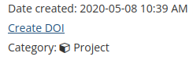
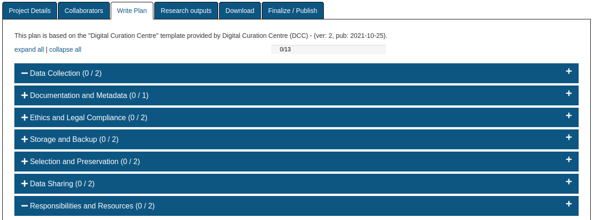

```{r xaringan-themer, include=FALSE, warning=FALSE}
# #This block contains the theme configuration for the CSS lab slides style
library(xaringanthemer) #
library(showtext)
style_mono_accent(
  base_color = "#1f5c99",
  text_font_size = "1.5rem",
  header_font_google = google_font("Raleway"),#("Yanone Kaffeesatz"),
  text_font_google   = google_font("Arial", "300", "300i"),
  code_font_google   = google_font("Fira Mono")
)
```

```{r setup, include=FALSE}
options(htmltools.dir.version = FALSE)
```

layout: true

---

# Data Management (plans)

 * Overview of formats and types of data
 
 * Research methodology (data collection, processing, and analyzing)
 
 * Roles & responsibilities for data collection, description, processing, analysis
 
 * Standards you will use to describe your data (metadata)
 
 * Storage and backup procedures 
 
 * Long-term archiving and preservation plan 
 
 * Access policies and provisions for secondary uses

 * Security measures taken to protect data and/or participant confidentiality


---

# Repositories: 

* Keeping track & (optional) sharing

* (Long-term) data storage

* Find the repository that suits you: 
    * [Zenodo](www.zenodo.org): European Union
    * [Open Science Framework](www.osf.io)
    * [Figshare](https://figshare.com/features)
    * [Github](www.github.com) for code
    * Institutional repositories
    
* [Registry of research data repositories](https://www.re3data.org/)

---

## Assign a DOI to your dataset

Digital Object Identifier
```{r, echo=FALSE, out.width=60}
knitr::include_graphics("figures/DOI_logo.svg.png")
```
  * unique & never changable
  * citable
  * findable: doi.org/identifier
  
```{r, echo=FALSE, out.width=300, fig.align='center'}

```

---

## DMP Tool

```{r, echo=FALSE, out.width=1000}

```

---

# Resources

* Tutorials & guides data management
    * [Tutorial: Basics of Research Data Management](https://www.youtube.com/watch?v=3sDhQRIYUmA) (Foster, OpenAire)
    * [Research data management 101](https://www.youtube.com/watch?v=_pHVMwfOZf8) (University of Sydney)
    * [Guide to writing "readme" style metadata](https://data.research.cornell.edu/content/readme#bestpractices) (Research Data Management Service Group)
    
* Digital tools to create your data management plan
    * [DMP tool](https://dmptool.org)
    * [DMP online](https://dmponline.dcc.ac.uk/)


