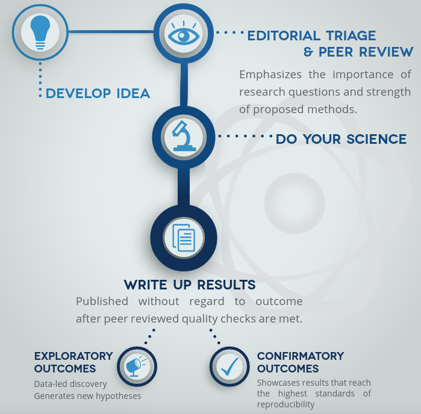
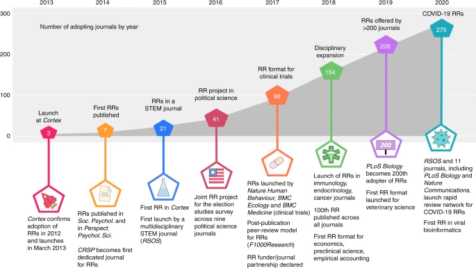

```{r xaringan-themer, include=FALSE, warning=FALSE}
# #This block contains the theme configuration for the CSS lab slides style
library(xaringanthemer) #
library(showtext)
style_mono_accent(
  base_color = "#1f5c99",
  text_font_size = "1.5rem",
  header_font_google = google_font("Raleway"),#("Yanone Kaffeesatz"),
  text_font_google   = google_font("Arial", "300", "300i"),
  code_font_google   = google_font("Fira Mono")
)
```

```{r setup, include=FALSE}
options(htmltools.dir.version = FALSE)
```

layout: true
<div class = "my-footer"> <span>
<a href="https://www.zotero.org/groups/479248/osf/collections/KEJP68G9"> Zotero library with RRs; </a> 
<a href="https://www.cos.io/initiatives/registered-reports"> More on RRs </a> 
</span> </div>

---

# Registered Reports (RR)

.pull-left[.center-left[
* Peer-reviewed preregistration  <br> prior to data collection

<!-- ```{r, echo=FALSE, out.width=800, fig.align='center'} -->
<!--  -->
<!-- ``` -->

* publication independent of results

* protects against reviewer HARKing

* reduces bias & increases rigor

_"Because the study is accepted in advance, the incentives for authors change from producing the most beautiful story to the most accurate one."_  Chris Chambers
]]

.pull-right[.center-right[
```{r, echo=FALSE, out.width=470, fig.align='right'}

```
]]

---
layout: true
<div class = "my-footer"> <span>
<a href="https://twitter.com/chrisdc77/status/1585908780394487809"> Chris Chambers on PC Reg Reports on Twitter
</a> </span> </div>

---

## Community control over review & publishing RRs

**From reforming journals to reclaiming control & value**

.pull-left[.center-left[
```{r, echo=FALSE, out.width=450}

```

```{r, echo=FALSE, out.width=400}

```
]]

.pull-right[
* Journals justify fees with added value of editing/review

[Peer Community In](https://rr.peercommunityin.org/) 
* free meta-journal platform that reviews & recommends RRs
* since 2022
* Brings value of peer-review back to community
* Publishing in journals still possible
]

???

<!-- --- -->
<!-- layout: true -->
<!-- <div class = "my-footer"> <span> -->
<!-- <a href="https://doi.org/10.1016/j.cortex.2017.07.014"> McIntosh (2017) Exploratory reports: A new article type for Cortex; </a>  -->
<!-- <a href = "https://osf.io/vzse8/wiki/Author%20guidelines%20and%20editorials/"> OSF Resources for RRs </a> </span> </div> -->

<!-- --- -->

# Exploratory Reports

.pull-left[.center-left[
* Open questions without strong predictions
* Generation of hypotheses

* Emphasis on transparency & <br> rigor instead of novelty
  * Open data & materials
  * No story telling
  
* Benefits of preregistering exploratory research? <font size ="5">
<a href = "https://journals.plos.org/plosbiology/article?id=10.1371/journal.pbio.3000690"> Dirnagel, 2020 </a>
</font>

]]

--

.pull-right[.center-right[

**Useful for e.g.** 
* data mining
* detailed single case descriptions
* clinical database for uncommon conditions
* true story of experiments

**Templates**
* Neuroscience @ [Cortex](https://www.elsevier.com/__data/promis_misc/Exploratory_Reports_Guidelines.pdf)
* [Social Psychology](https://osf.io/mdz3g/) @ [IRSP](https://www.rips-irsp.com/about/exploratory-reports/)
]]

---
layout: true
<div class="my-footer"><span><a href = "www.hannahmetzler.eu"> Hannah Metzler </a> </span></div> 

---

## Choosing journals for reproducible research

* Finding/evaluating journals:

    * Over 300 journals that accept [Registered Reports](https://www.cos.io/initiatives/registered-reports)
    
    * Journals that allow pre-registration: [Sherpa Romeo](https://v2.sherpa.ac.uk/romeo/)
    
    * [TOP factor](https://topfactor.org/): Ranked by transparency & openess criteria ([about TOP](https://www.natureindex.com/news-blog/top-factor-rates-journals-on-transparency-openness))
    
    * [Scimagojr](www.scimagojr.com/journalrank.php): Rankings per discipline (not specifically open science)
    
---

# Exercise [10 min]

* In the list of journals that accept [Registered Reports](https://www.cos.io/initiatives/registered-reports), check for journals in your discipline. 

* Check if some journals in your discipline are listed on the [TOP factor](https://topfactor.org/) ranking